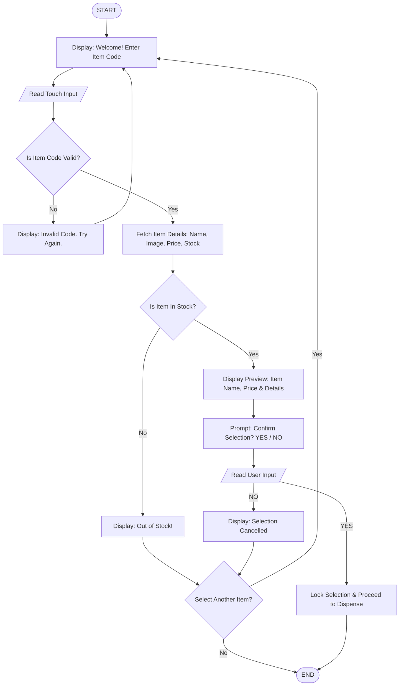

# Annex B: Computational Thinking Exercise - Smart Vending Machine

**Section:** Balingkilat  
**C# / Name:** #8 - Cepillo, Ryan Meiko L.  
**Date:** August 12, 2026

---

## Step 1: Identify the Big Problem

**Main Problem:**  
The school’s vending machine is very unreliable, inefficient, and faulty resulting in poor user experience and slow service.

---

## Step 2: Identify Sub-Problems

1. **Incorrect Change:** The machine miscalculates or fails to dispense the accurate change to its users.
2. **Lack of Inventory Tracking:** Items run out without notifying staff or updating the display, causing the users to attempt to buy out-of-stock items.
3. **User Selection Errors:** Users frequently press the wrong buttons, resulting in purchasing unintended items.
4. **Transaction Efficiency:** The system processes requests slowly during peak usage times when multiple users use it consecutively.

---

## Step 3: Define Computational Thinking Approaches

| Sub-Problem | CT Skill | Example Solution |
| :--- | :--- | :--- |
| **1. Incorrect Change** | **Algorithmic Thinking** | Implement an automated change calculation routine that checks hopper coin levels before validating payment and dispenses exact currency combinations using standard change-making algorithms. |
| **2. Lack of Inventory Tracking** | **Pattern Recognition** | Connect item slot weight/optical sensors to an online database to update stock levels in real time, lock empty slots automatically, and alert school canteen staff when stock falls below 15%. |
| **3. User Selection Errors** | **Abstraction** | Replace the traditional keypad with a touch-screen display that shows item images, descriptions, and a final visual "Confirm Choice" prompt before initiating the purchase. |
| **4. Transaction Efficiency** | **Decomposition** | Implement quick digital payment integrations (like RFID/student ID cards) and run sensor checks in parallel to minimize queuing times during peak school breaks. |

---

## Step 4: Draw a flowchart or write a pseudocode for the identified sub-problem

### **Selected Sub-Problem:** User Selection Errors

---

## Step 5: Reflection/Explanation
By decomposing the complex "Smart Vending Machine" issue into smaller sub-problems, we were able to isolate individual points of defect. Breaking down a massive, overwhelming problem into smaller, bite-sized tasks made designing targeted solutions much easier and allowed us to build an efficient, step-by-step logic flow without getting lost in overall system complexity.
