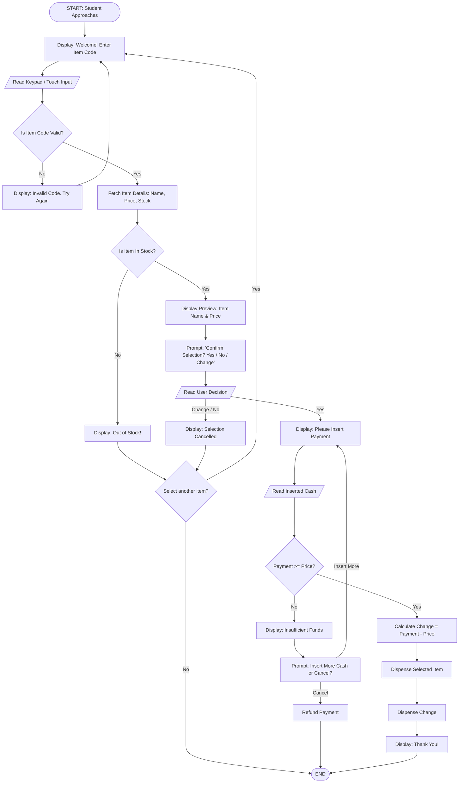

# Annex B: Computational Thinking Exercise - Smart Vending Machine

**Section:** Balingkilat  
**C# / Name:** #8 - Cepillo, Ryan Meiko L.  
**Date:** August 12, 2026

---

## Step 1: Identify the Big Problem

**Main Problem:**  
The school’s vending machine is very unreliable, inefficient, and faulty resulting in poor user experience and slow service.

---

## Step 2: Identify Sub-Problems

1. **Incorrect Change:** The machine miscalculates or fails to dispense the accurate change to its users.
2. **Lack of Inventory Tracking:** Items run out without notifying staff or updating the display, causing the users to attempt to buy out-of-stock items.
3. **User Selection Errors:** Users frequently press the wrong buttons, resulting in purchasing unintended items.
4. **Transaction Efficiency:** The system processes requests slowly during peak usage times when multiple users use it consecutively.

---

## Step 3: Define Computational Thinking Approaches

| Sub-Problem | CT Skill | Example Solution |
| :--- | :--- | :--- |
| **1. Incorrect Change** | **Algorithm Design** | Write a precise logic routine: $\text{Change} = \text{Amount Paid} - \text{Item Cost}$. Verify available bills/coins in the hopper before accepting payment, then dispense exact change. |
| **2. Unnotified Out-of-Stock Items** | **Pattern Recognition / Data Processing** | Track stock counts using inventory sensors. When an item count reaches 0, automatically display "Out of Stock" on screen and send a notification to the supplier/staff. |
| **3. Accidental Item Selection** | **Abstraction** | Simplify the user interface by adding a screen preview with a confirmation prompt (e.g., *"You selected Item A: [Yes/No]"*) before charging the user. |
| **4. Slow Performance** | **Decomposition** | Break down the checkout sequence into parallel processes so hardware checks (coin validation, dispenser initialization) run concurrently rather than sequentially. |

---

## Step 4: Draw a flowchart or write a pseudocode for the identified sub-problem

### **Selected Sub-Problem:** Item Selection & Change Calculation

